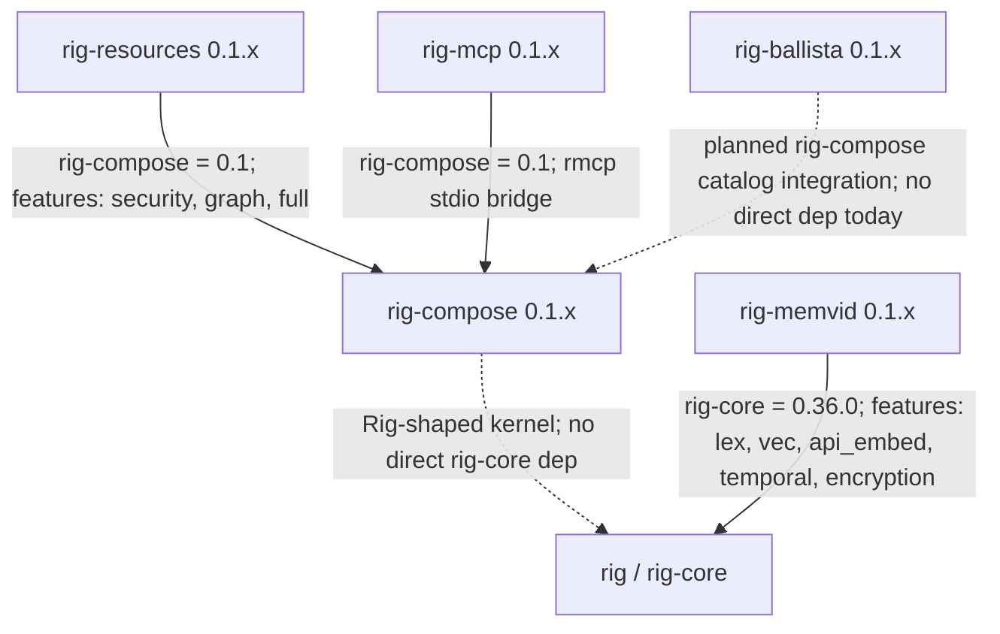

# rig-ballista

Apache Ballista + DataFusion + Iceberg companion crate for rig-compose. Scaffolding; iceberg-rust integration pending toolchain verification.

[](https://github.com/ForeverAngry/rig-ballista/actions/workflows/ci.yml)
[](https://crates.io/crates/rig-ballista)
[](https://docs.rs/rig-ballista)
[](#license)
[](#status)

## Overview

`rig-ballista` is the metadata-catalog seam for future Ballista, DataFusion, and Iceberg integration. The crate currently ships a domain-neutral `MetadataCatalog<S>` trait, file-stat data types, storage errors, and a thread-safe `InMemoryMetadataCatalog<S>` reference implementation.

It does not yet depend on Ballista, DataFusion, Iceberg, or `rig-compose`; those dependencies remain planned and commented in [Cargo.toml](Cargo.toml) until the upstream combination is verified on stable Rust.

## Why It Exists

Agent planners need a way to prune column-store files using per-file sketches before paying to materialize data. That pruning seam should not force every `rig-compose` consumer to compile Ballista, Arrow, Parquet, DataFusion, and Iceberg, nor should those crates leak into the public API.

`rig-ballista` isolates that future query-engine boundary behind `MetadataCatalog<S>`, where `S` is the caller's own sketch type.

## Status

- Crate version: `0.1.0`.
- Rust edition: 2024.
- MSRV: 1.88 during the placeholder phase.
- Status: scaffolding. `MetadataCatalog<S>` and `InMemoryMetadataCatalog<S>` ship today; the Iceberg plus Ballista-backed catalog is pending toolchain verification.
- `PlaceholderCatalog` is deprecated and retained only for source compatibility with the initial scaffolding release.
- No direct `rig-core` or `rig-compose` dependency currently exists. Planned dependencies are intentionally commented out in [Cargo.toml](Cargo.toml).

## Feature Flags

`rig-ballista` currently defines no feature flags. `just check` still runs clippy, tests, and docs with `--all-features` so newly introduced flags are covered by default.

## Key Types

- [src/catalog.rs](src/catalog.rs): `MetadataCatalog<S>`, the async read-only catalog trait. It exposes `list_files(partition)` and `get(file_id)`.
- [src/catalog.rs](src/catalog.rs): `FileId`, a stable UUID-backed file identifier.
- [src/catalog.rs](src/catalog.rs): `FileStats<S>`, the per-file partition tag plus caller-defined sketch payload.
- [src/catalog.rs](src/catalog.rs): `StorageError`, including `NotFound(FileId)` and `Backend(#[source] Box<dyn Error + Send + Sync>)` with the `StorageError::backend(err)` constructor.
- [src/catalog.rs](src/catalog.rs): `InMemoryMetadataCatalog<S>`, a `DashMap`-backed reference implementation for tests and offline harnesses.
- [src/lib.rs](src/lib.rs): `PlaceholderCatalog`, deprecated since `0.1.1` in favor of `InMemoryMetadataCatalog`.

The public surface deliberately keeps Iceberg, Ballista, DataFusion, Arrow, and object-store types out of signatures.

## Integration With Rig

Today, integration is architectural rather than dependency-level: downstream `rig-compose` agents can depend on `MetadataCatalog<S>` to prune files by caller-owned sketch type. The future Ballista/Iceberg implementation is expected to plug into the same trait without changing agent-facing code.

Because `rig-ballista` currently has no `rig-core` or `rig-compose` dependency, there is no pinned Rig version to report.

## Usage

The catalog behavior is covered by unit tests in [src/catalog.rs](src/catalog.rs), including partition filtering, direct lookup, and empty/not-found behavior.

```rust,no_run
use rig_ballista::{FileId, FileStats, InMemoryMetadataCatalog, MetadataCatalog};

#[derive(Clone)]
struct Sketch {
    distinct: u64,
    variance: f64,
}

# async fn run() -> Result<(), Box<dyn std::error::Error>> {
let catalog = InMemoryMetadataCatalog::<Sketch>::new();
let id = FileId::new();

catalog.insert(FileStats {
    id,
    partition: "auth".into(),
    sketch: Sketch {
        distinct: 1_024,
        variance: 0.7,
    },
});

let files = catalog.list_files(Some("auth")).await?;
assert_eq!(files.len(), 1);

let stats = catalog.get(id).await?;
assert_eq!(stats.partition, "auth");
# Ok(()) }
```

## Validation

Canonical validation is `just check`.

That recipe runs formatter checks, `cargo clippy --all-targets --all-features -- -D warnings`, `cargo test --all-targets --all-features`, and rustdoc with all features and `-D warnings -D rustdoc::broken_intra_doc_links`.

## Gotchas

- The crate is intentionally not the real Ballista/Iceberg integration yet. Do not add those dependencies until the verification crate confirms the combination compiles on stable.
- The eventual integration may raise MSRV to whatever the upstream query stack requires, shipped as a breaking `feat!:` change.
- `MetadataCatalog<S>` is generic over caller-owned sketches; the crate does not prescribe HLL, variance, histograms, or any other sketch shape.
- `StorageError::Backend` preserves the original source error chain; use `StorageError::backend(err)` instead of stringifying backend failures.

## Ecosystem

These companion crates are maintained as separate repositories. Together they form a small stack around the upstream Rig project: `rig-compose` provides the kernel surface, `rig-resources` contributes reusable skills and tools, `rig-mcp` moves tools across MCP, `rig-memvid` connects Rig agents to persistent `.mv2` memory, and `rig-ballista` reserves the metadata-catalog seam for future query-engine integration.



Pinned Rig-facing dependencies from the current manifests:

| Crate | Direct Rig-facing dependency | Notes |
| --- | --- | --- |
| `rig-compose` | none | Defines a Rig-shaped kernel surface without depending on `rig-core`. |
| `rig-resources` | `rig-compose = 0.1` | Uses a sibling path during local workspace development. |
| `rig-mcp` | `rig-compose = 0.1` | Uses a sibling path during local workspace development. |
| `rig-memvid` | `rig-core = 0.36.0` | Implements Rig vector-store and prompt-hook flows over Memvid. |
| `rig-ballista` | none today | Ballista/Iceberg/DataFusion dependencies remain planned and commented out. |

The concrete multi-crate workflow tested today is the MCP loopback path: a `rig_compose::ToolRegistry` is exposed through `rig_mcp::LoopbackTransport`, remote schemas are wrapped as `rig_mcp::McpTool`, and the wrapped tools are registered back into another `ToolRegistry`. That proves a local `rig-compose` tool and an MCP-adapted tool are indistinguishable to callers. The backing test is `mcp_tool_indistinguishable_from_local` in [rig-mcp/src/transport.rs](https://github.com/ForeverAngry/rig-mcp/blob/main/src/transport.rs).

## License

Licensed under either Apache-2.0 or MIT, at your option.
